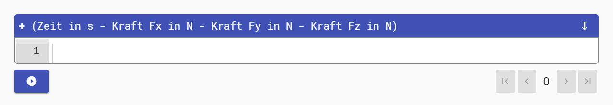

<!--
author:   Nancy Brinkmann, Ronny Stolze

email:    nancy.brinkmann@hs-magdeburg.de, ronny.stolze@hs-magdeburg.de

version:  1.0.0

language: de_DE

narrator: DE FEMALE

comment:  Try to write a short comment about
          your course, multiline is also okay.

script:  https://cdnjs.cloudflare.com/ajax/libs/echarts/4.1.0/echarts-en.min.js
-->

# Testvideos ...

Videos aus dem **Projektordner**

~~1. Möglichkeit **lokaler Pfad** - derzeit **nicht** möglich~~

Ein Video, das sich in Ihrem Projektordner (also lokal auf ihrem Rechner bzw. online bei GitHub) befindet, binden Sie wie ein Bild ein. Damit sich die Größe des Videos an die Größe ihres Browsers anpasst, ergänzen Sie den Pfad wie folgt:

`!?[movie](movies/math.mp4)<!--`
 
`style = "width: 100%; "`
 
`-->`

!?[movie](movies/math.mp4)<!--
style = "width: 100%; "
-->

 
~~2. Möglichkeit **absolute URLs (Pfad auf GitHub)**~~

`?[movie](https://raw.githubusercontent.com/ILIFV-NB/TestKurs/master/movies/math.mp4)<!--`
 
`style = "height: 446px; width: 793px; "`
 
`-->`

!?[movie](https://raw.githubusercontent.com/ILIFV-NB/TestKurs/master/movies/math.mp4)<!--
style = "height: 446px; width: 793px; "
-->

!?[movie](https://raw.githubusercontent.com/ILIFV-NB/TestKurs/master/movies/test1_NX8.mp4)<!--
style = "height: 446px; width: 793px; "
-->

 
Videos aus dem **Internet** (YouTube):

~~1. Möglichkeit **Video-URL** - im Moment im eLab **nicht möglich**~~

Öffnen des gewünschten Videos auf YouTube, Klick mit der rechten Maustaste darauf und  ~~Video-URL kopieren~~ wählen. Diese an entsprechender Stelle im Dokument platzieren  - dort, wo normalerweise der lokale Pfad aufgeführt sit:

`!?[embedded media](https://youtu.be/bICfKRyKTwE)`

!?[embedded media](https://youtu.be/bICfKRyKTwE)

~~2. Möglichkeit **Einbettungscode**~~

<iframe width="793" height="446" src="https://www.youtube.com/embed/bICfKRyKTwE" frameborder="0" allow="accelerometer; autoplay; encrypted-media; gyroscope; picture-in-picture" allowfullscreen></iframe>

# Testbilder ...

Bilder aus dem **Projektordner**

~~1. Möglichkeit **lokaler Pfad** - derzeit **nicht** möglich~~$^* $
Ein Foto, das sich im Projektordner (also lokal auf dem Rechner bzw. online bei GitHub) befindet, wie ein Video einbinden. Damit sich die Größe des Bildes an die Größe des Browsers anpasst, den Pfad wie folgt ergänzen:

`<!--`
 
`style = "width: 100%; "`
 
`-->`

<!--
style = "width: 100%; "
-->

~~Erläuterung:~~

Um ein Bild einzubinden, muss dieses in dem zugehörigen Projektordner abgelegt sein. Dieser befindet sich in der Regel lokal auf dem Rechner im Ordner ~~GitHub~~ (synchronisiert mit dem Projektordner auf GitHub) und trägt idealerweise den Namen des Kurses. In jedem Projektordner sollten Ordner angelegt sein, die eigens für Fotos bzw. Videos zur Verfügung stehen. Diese können bspw. *images* bzw. *movies* heißen. (Weitere Erläuterungen unter [GitHub -> 4.](#4) bzw. [Atom -> 3.](#5))

In Atom innerhalb der Textdatei ~~img~~ eingeben und die ~~Tabtaste~~ drücken. Es erscheint ``. (Voraussetzung dafür ist die Installation des [Plugins](https://atom.io/packages/search?utf8=%E2%9C%93&q=liascript&commit=Search) *liascript-snippets*.) In die eckigen Klammern einen Hinweis eingeben, der verrät, um welche Art Datei es sich handelt. Für ein Foto kann dieser z.B. das Wort *image* sein. In die runden Klammern wird der Pfad innerhalb des Projektordners eingetragen. Heißt der Fotoordner *images* und das Foto *ErstesKursFoto.png*, sieht der Pfad wie folgt aus: ``. In der Preview (**Alt$+$L**) bzw. im Browser (**Strg$+$N**) erscheint an dieser Stelle das Foto.

$^* $Hier gilt also das Gleiche wie für Videos: **absolute** URLs nutzen, um die Bilder direkt im Netz laden zu können.

 
~~2. Möglichkeit **absolute URLs (Pfad auf GitHub)**~~

`<!--`
 
`style = "width: 100%; "`
 
`-->`

<!--
style = "width: 100%; "
-->

# Beispiele: Diagramme erzeugen

* [Zerspankräfte Drehen](#4) 
* [Rauheitskenngrößen](#5) 
* [Rauheitsprofile](#6) 
* [Durchmesser](#10)

### Zerspankräfte Drehen

Lade eine Datei mit deiner Zerspankraftmessung hoch: <input type="file" onchange="getFileContent(this.files)">

### Rauheitskenngrößen

Lade eine Datei mit deinen Rauheitskenngrößen hoch: <input type="file" onchange="getFileContent(this.files)">

### Rauheitsprofile

* [P-Profil](#6)

* [R-Profil](#7)

* [W-Profil](#8)

#### **P-Profil**

Lade eine Datei mit deinem P-Profil hoch: <input type="file" onchange="getFileContent(this.files)">

 

#### **R-Profil**

Lade eine Datei mit deinem R-Profil hoch:
<input type="file" onchange="getFileContent(this.files)">

 

#### **W-Profil**

Lade eine Datei mit deinem W-Profil hoch: <input type="file" onchange="getFileContent(this.files)">

### Durchmesser

Lade eine Datei mit deinem Durchmesser hoch: <input type="file" onchange="getFileContent(this.files)">

# Input
<form>
      <input id="groesse" type="number" min="100" max="220" step="1">
      <input id="masse" type="number" min="30" max="225" step="0.5">
</form>

 
<label for="fname">First name:</label>
<input type="text" id="fname" name="fname">

 
Versuch 1: Tragen Sie hier bitte hintereinander alle Werte zu Versuch 1 ein! (ap; vc; f; n; Versuch)

[[___ ___]]

# Test - Bild in Tabellen integrieren (Werkzeugmaschine)

~~**Drehmaschine**~~

<!--
style = "width: 75%; "
-->

*EMCOMAT E-300, zyklengesteuerte Drehmaschine*

 

|**Technische Daten**|**Antriebsleistung und Drehmomentenverlauf**|
|<!--
style = "width: 75%; "
-->|<!--
style = "width: 75%; "
-->|

**Technische Daten**

|Spitzenweite|$mm$ |$1500$ |
| Umlauf- $\text{\O}$ über Bett | $mm$|$570$ |
|Umlauf- $\text{\O}$ über Schlitten | $mm$ | $340$ |
| Vorschubkraft X max. | $kN$ | $10$ |
| Vorschubkraft Z max. | $kN$|$15$|
| Spindeldrehzahl| $U/min$| $0\space-\space2500$|
|Drehzahlregelung| | stufenlos|
| Antriebsleistung bei $40/100\space$ % ED|$kW $| $25/17$|
| max. Nennmoment an der Hauptspindel| $Nm$| $764/519$|
|Prozesskühlung| | Emulsion |

 

**Antriebsleistung und Drehmomentenverlauf**

<!--
style = "width: 75%; "
-->
